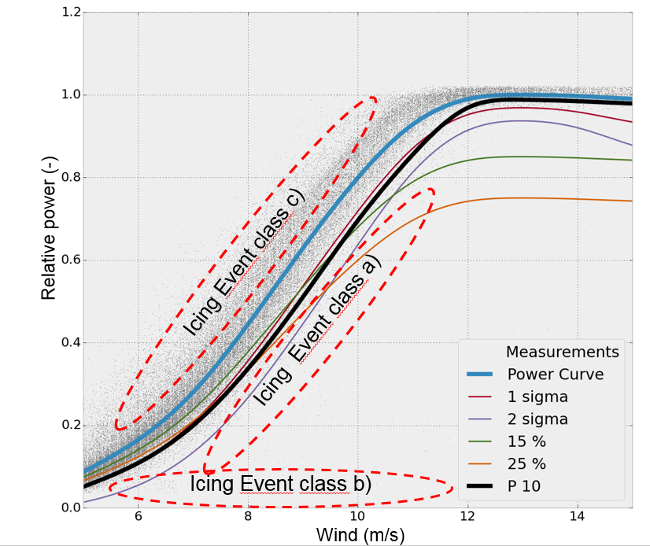

# Task19 Ice Loss Method

A standardized method to assess production losses due to icing from wind turbine SCADA data. This site describes a method to assess production losses due to icing based on standard SCADA data available from modern wind turbines.

# Motivation

Production losses due to wind turbine rotor icing are calculated with different methods, all resulting in different results. Task 19 has three main reasons why a standardized production loss calculation method is needed:

* There is a large need to compare different sites with each other with a systematic analysis method
* To validate the IEA Ice Classification
* Evaluate effectiveness of various blade heating systems

With the method described here, anyone with access to SCADA data from wind turbines can assess and calculate turbine specific production losses due to icing. The standardized method will use existing standards and will be developed in order to minimize the uncertainties related to production loss estimations from SCADA data. The method does not require icing measurements as input.

# Method

Task 19 proposes a method that is robust, easily adaptable, filters outliers automatically and does not assume a normal distribution of the SCADA data for individual turbines and wind farms. The proposed method uses percentiles of the reference, non-iced power curve in combination with temperature measurements. Ice build-up on turbine blades gradually deteriorates the power output (or results to overproduction to iced anemometer) so for increased accuracy the method uses three consecutive 10-minute data points for defining start-stop timestamps for icing events. In other words, the turbine rotor is used as an ice detector. Iced turbine power losses are defined by comparing the performance to the calculated power curve using heated anemometers from nacelle and the measured reference, expected power curve. Production losses are separated into 2 categories: operation and standstill losses due to icing. The different icing event cases are illustrated in the picture below: Event class A, reduced production due to icing, Event Class B, turbine stops due to icing and event class C, apparent overproduction due to icing.
 

On a general level, the method can be divided into 3 main steps:

1. Calculate reference, non-iced power curve
2. Calculate start-stop timestamps for different icing event classes
3. Calculate production losses due to icing

Below is the list of required SCADA data signals used as input for the production loss calculation method.

Signal | Description | Unit | Value
------ | ----------- | ---- | -----
ws | Hub height wind speed | m/s | 10-minute mean
temp | Ambient temperature (hub height) | °C | 10-minute mean
pwr mean | Turbine output power | kW | 10-minute mean
mode | Turbine operational mode | - | 10-minute mean

# Usage

The production loss calculator is configured by setting up a config file. Then calling the script ``t19_counter.py`` by giving the ini file as a command line parameter as :

    python t19_counter.py site.ini

where ``site.ini`` contains the case definition relevant for your site. See the included documentation for more details on how to set up the .ini file.

# IEA Wind
The International Energy Agency Implementing Agreement for Co-operation
in the Research, Development and Deployment of Wind Energy Systems (IEA Wind) is
a vehicle for member countries to exchange information on the planning and execution
of national, large-scale wind system projects and to undertake co-operative research and
development projects called Tasks or Annexes. IEA Wind is part of IEA’s Technology
Collaboration Programme or TCP.

# Task 19
For the wind industry, cold climate refers to sites that may experience significant
periods of icing events, temperatures below the operational limits of standard wind
turbines, or both. There is vast potential for producing electricity at these often windy
and uninhabited cold climate sites. Consequently, the International Energy Agency
Wind Agreement has since 2002, operated the international working group Task 19
Wind Energy in Cold Climates. The goal of this cooperation is to gather and
disseminate information about wind energy in cold climates and to establish guidelines
and state-of-the-art information.

# Disclaimer: 
The IEA Wind agreement, also known as the Implementing Agreement for
Co-operation in the Research, Development, and Deployment of Wind Energy Systems,
functions within a framework created by the International Energy Agency (IEA). Views,
findings, and publications of IEA Wind do not necessarily represent the views or policies
of the IEA Secretariat or of all its individual member countries.

# License

The code is available under the Three Clause BSD License.

